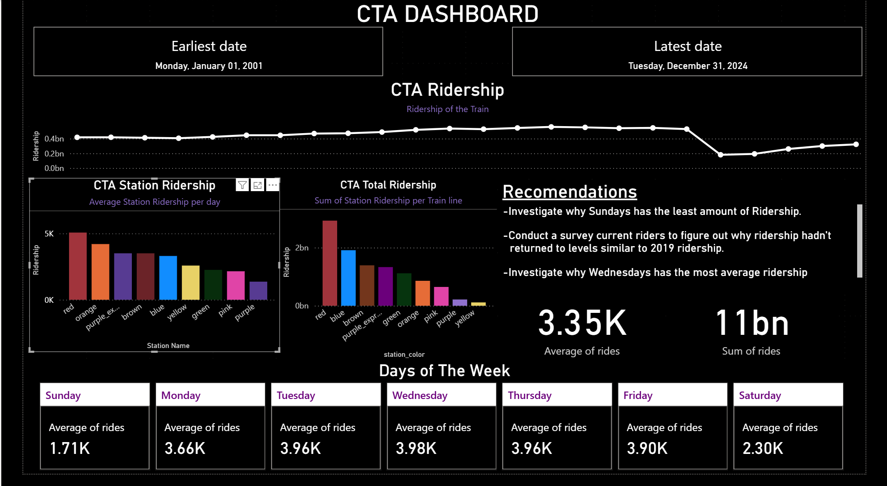

# Context of the Project
A few weeks ago, I learned how the State Government needed to sign a budget bill so public transportation such as Metra, CTA, and Pace can function normally in the state. I gotten curious on how impactful public transportation are for people so I organized a project to answer this question. The data used for this project was from the Chicago Data Portal, finding data tables that contain any information about the trains. 

## Quick Insights
- The red line is the busiest line on average
- Thursday is the busiest day on average ridership per station, while Sunday has the least amount of ridership
- CTA Ridership has been slowly rising since 2020, but even before 2020, CTA ridership has been decreasing since 2015 (This means there is a hidden issue with the CTA that may have been resloved due to a greater threat, COVID-19)

## Tools used
This project required me to learn how to run and manage a PostgreSQL server, create and import CSV files into databases. I utilize SQL to write queries that join tables by station name, allowing me to determine which color line each station is on. Utilize Subqueries to filter datasets and identify the stations with the highest average ridership. I learned how to import data from my SQL database into Power BI and create a custom dashboard highlighting findings on this project.

This document will have both SQL files used to help explore this data and the tables used for the dashboard. 

## Video of the Dashboard

## Static Dashboard Image

 

## Files
